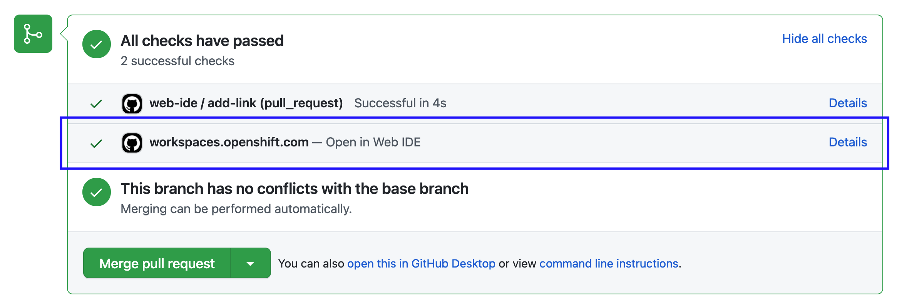
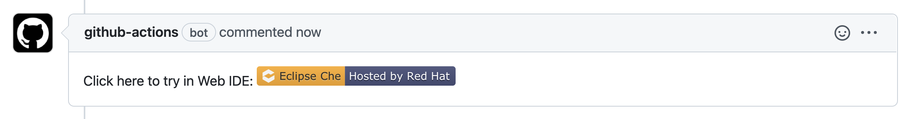

# Try in Web IDE

[](https://github.com/redhat-actions/try-in-web-ide/actions/workflows/ci.yml)
[](https://workspaces.openshift.com#https://github.com/redhat-actions/try-in-web-ide)

GitHub action will add a comment and/or status check with a link to open the project on an online web IDE instance.

#### Adding a link in PR status check:


#### Adding a link in PR comment:

cool
# Usage
```yaml
# Add Web IDE link on PRs
name: web-ide

on:
  pull_request_target:
    types: [opened, synchronize]

jobs:
  add-link:
    runs-on: ubuntu-20.04
    steps:
      - name: Web IDE Pull Request Check
        id: try-in-web-ide
        uses: redhat-actions/try-in-web-ide@v1
        with:
          github_token: ${{ secrets.GITHUB_TOKEN }}
```

## Action Inputs

| Input Name | Description | Default |
| ---------- | ----------- | ------- |
| github_token | GitHub token used to add PR comment and/or status check. | **Must be provided**
| add_comment | If `true`, the action will add comments on each PR with a link to try the PR in Web IDE. | `true`
| add_status | If `true`, the action will add a PR status check on each PR with a link to try the PR in Web IDE. | `true`
| web_ide_instance | The base url for the web IDE instance. | `https://workspaces.openshift.com`
| comment_badge | The badge url for the comment created when `add_comment` is `true`. | `https://img.shields.io/badge/Eclipse_Che-Hosted%20by%20Red%20Hat-525C86?logo=eclipse-che&labelColor=FDB940`

# Scenarios
- [Disable comment on pull requests](#add-comment-on-pull-requests)
- [Disable status check on pull requests](#disable-status-check-on-pull-requests)
- [Customize the link to online Web IDE instance](#customize-the-link-to-online-web-ide-instance)

## Add comment on pull requests

```yaml
- name: Web IDE Pull Request Check
  id: try-in-web-ide
  uses: redhat-actions/try-in-web-ide@v1
  with:
    github_token: ${{ secrets.GITHUB_TOKEN }}
    add_comment: false
```

## Disable status check on pull requests

```yaml
- name: Web IDE Pull Request Check
  id: try-in-web-ide
  uses: redhat-actions/try-in-web-ide@v1
  with:
    github_token: ${{ secrets.GITHUB_TOKEN }}
    add_status: false
```

## Customize the link to online Web IDE instance

```yaml
- name: Web IDE Pull Request Check
  id: try-in-web-ide
  uses: redhat-actions/try-in-web-ide@v1
  with:
    github_token: ${{ secrets.GITHUB_TOKEN }}
    web_ide_instance: https://my-online-ide-instance.com
```

# Contributing
## Running the linter
```
npm run lint
```
## Generating `dist/index.js`
```
npm run bundle
```
## Updating the GitHub action's input and output
After updating `action.yml`, run:
```
npx action-io-generator -o src/generated/inputs-outputs.ts
```
## Running tests
```
npm run test
```